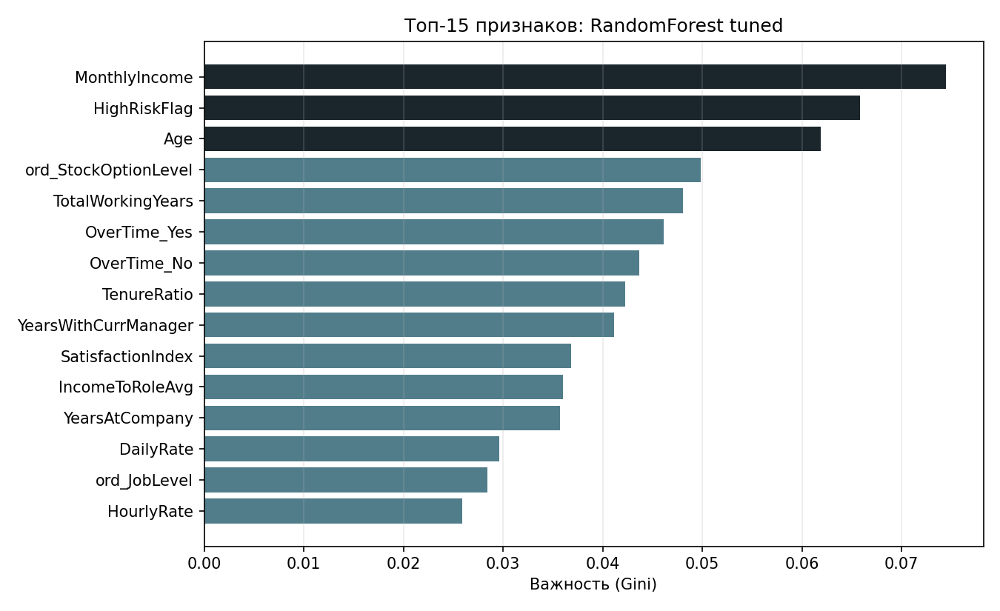
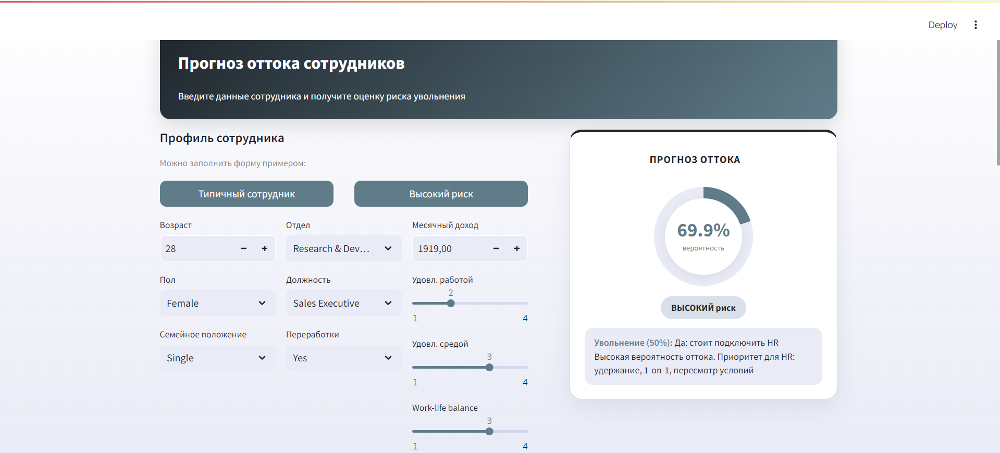
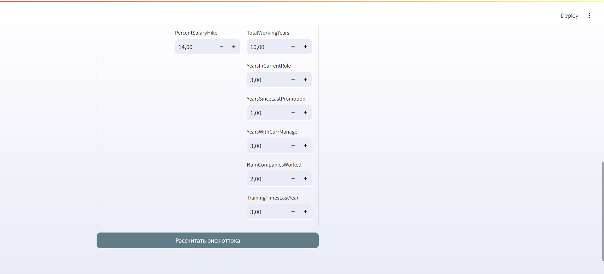
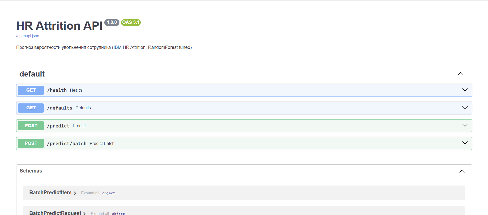

# Отчёт по проекту (CP3)

**Студент:** Целовальникова Александра Тимофеевна  
**Группа:** БИВ231

---

## 1. Введение и постановка задачи

**Цель проекта:** предсказать вероятность увольнения сотрудника (`Attrition`) и ранжировать сотрудников по риску оттока
**Формулировка задачи:** классификация
**Обоснование метрики качества:**

- основное: **ROC-AUC**, так как тут есть ранжирование рисков
- также важен **Recall** по классу "уволился", чтобы снижать пропуски потенциального ухода
- для баланса качества также оцениваем Precision, F1, Accuracy

---

## 2. Поиск и описание данных

**Источник:** [IBM HR Analytics Employee Attrition](https://www.kaggle.com/datasets/pavansubhasht/ibm-hr-analytics-attrition-dataset)

**Парсинг:** при автозагрузке ответ HTTP читается как текст, затем разбирается модулем `src/attrition_parser.py` (`csv.DictReader` -> `pandas.DataFrame`), после чего таблица сохраняется в `data/raw/`, дальше EDA и обучение читают уже сохранённый CSV. Команда: `python -m src.scripts.download_data`

**Причина выбора:** табличный HR-кейс с реалистичным дисбалансом классов и широким набором признаков

**Основные Характеристики:**

- 1470 строк, 35 колонок (включая target)
- данные смешанного типа (числовые + категориальные)

---

## 3. Обработка и подготовка данных

**Сделано:**

- удалены константы/служебные поля (`EmployeeCount`, `Over18`, `StandardHours`, `EmployeeNumber`)
- проверены и удалены дубликаты
- обработка пропусков (медиана для числовых, мода для категориальных)
- приведение типов и бинаризация таргета (`Yes/No -> 1/0`)
- для числовых признаков выполнено мягкое ограничение выбросов
- категориальные признаки: ordinal encoding для порядковых и one-hot для номинальных
- масштабирование числовых/порядковых признаков

**Работа с фичами:**

- `IncomeToRoleAvg`: насколько доход сотрудника выше/ниже среднего по его роли
- `TenureRatio`: стаж в компании относительно возраста
- `SatisfactionIndex`: средний индекс по удовлетворенности
- `HighRiskFlag`: риск-скор из 3 бинарных триггеров (overTime, низкая удовлетворенность, маленький стаж)

**Сплит:**

- `train/val/test = 64%/16%/20%`
- стратификация по `Attrition`
- leakage не возникает (нет временной структуры, сплит выполняется до обучения моделей)

---

## 4. Baseline-модель

- **Модель:** `LogisticRegression(class_weight="balanced")`
- **Результаты:**
  - Validation: ROC-AUC = **0.871**, Recall = **0.816**, F1 = **0.534**
  - Test: ROC-AUC = **0.774**, Recall = **0.617**, F1 = **0.460**
- **Цель:** точка отсчёта для сравнения с более сложными моделями

---

## 5. Эксперименты

1. **Гипотеза:** нелинейные ансамбли улучшают качество относительно линейной модели

   **Проверка:** 4 модели (`LogReg`, `RandomForest`, `XGBoost`, `LightGBM`) с 5-fold stratified CV и проверкой на val/test

   **Результат:** лучший `val ROC-AUC` среди базовых настроек у `LogReg + FE` (0.872), но по отдельным метрикам есть компромисс на test

2. **Гипотеза:** тюнинг `RandomForest` улучшит ROC-AUC/Recall

   **Проверка:** `RandomizedSearchCV` (`n_iter=20`) по `n_estimators`, `max_depth`, `min_samples_leaf`, `min_samples_split`

   **Результат:** лучшая конфигурация `n_estimators=700, max_depth=6, min_samples_leaf=8, min_samples_split=10`,  
   `val ROC-AUC = 0.874`, `val Recall = 0.579`

3. **Гипотеза:** сжатие признаков через **PCA** (95% дисперсии) + логрег стабилизирует качество

   **Проверка:** `StandardScaler` -> `PCA(0.95)` -> `LogisticRegression`

   **Результат:** на **val** ROC-AUC ниже, чем у tuned `RandomForest`, но на **test** ROC-AUC у `PCA95+LogReg` **выше**, чем у финального RF

4. **Гипотеза:** синтетическое расширение только train-части до 10 000 строк улучшит устойчивость модели на test

   **Проверка:** `python -m src.scripts.make_synthetic_train`.
   Метод:
   - сначала делим исходный датасет на train/val/test (стратифицировано)
   - расширяем только train bootstrap-сэмплированием с малым гауссовым шумом на числовых признаках
   - val/test оставляем без изменений
   - сравниваем метрики baseline logistic до/после

   **Результат:**
   - train: `940 -> 10000` строк
   - validation почти без изменений
   - на test выросли `Recall` и `F1` при сохранении `ROC-AUC`

**Таблица экспериментов:**

| Модель                   | ROC-AUC (val/test) | Recall (val/test) | F1 (val/test)     |
| ------------------------ | ------------------ | ----------------- | ----------------- |
| Baseline LogReg (без FE) | 0.871 / 0.774      | 0.816 / 0.617     | 0.534 / 0.460     |
| LogReg + FE              | 0.872 / 0.767      | 0.789 / 0.617     | 0.545 / 0.439     |
| RandomForest + FE        | 0.865 / 0.718      | 0.158 / 0.128     | 0.267 / 0.211     |
| XGBoost + FE             | 0.830 / 0.730      | 0.342 / 0.191     | 0.491 / 0.269     |
| LightGBM + FE            | 0.819 / 0.714      | 0.421 / 0.255     | 0.525 / 0.312     |
| RandomForest tuned       | **0.874 / 0.720**  | 0.579 / 0.362     | **0.557 / 0.366** |

Сравнение baseline logistic до/после синтетического расширения train:

| Вариант                | Train rows | ROC-AUC (val/test) | Recall (val/test) | F1 (val/test) |
| ---------------------- | ---------- | ------------------ | ----------------- | ------------- |
| До расширения          | 940        | 0.872 / 0.767      | 0.789 / 0.617     | 0.545 / 0.439 |
| После расширения train | 10000      | 0.865 / 0.767      | 0.789 / 0.638     | 0.541 / 0.480 |

---

## 6. Финальная модель и интерпретируемость

**Итоговая модель:** **RandomForest tuned**: лучший `val ROC-AUC` среди протестированных конфигураций при приемлемом `Recall`

**Почему на test ROC-AUC у tuned RF ниже, чем у baseline LogReg (0.720 vs 0.774), хотя на val RF лучше:**

- Мы выбираем финальную модель по **validation**, а не по test (чтобы не подгонять выбор под test)
- По validation tuned RF немного лучше: `val ROC-AUC = 0.874` против `0.871` у LogReg
- На test он оказался хуже, потому что датасет небольшой и результат на одном test-сплите может заметно колебаться
- LogReg обычно стабильнее на маленьких данных, поэтому здесь она выиграла именно на test
- RF выбран по правилу отбора через validation.

**Интерпретируемость**

График топ-15 признаков по финальному bundle:



**Что видно по модели:**

- **Доход и стаж:** `MonthlyIncome`, `TotalWorkingYears`, `YearsWithCurrManager`, `Age`, `TenureRatio`: чем "хуже" профиль по деньгам и карьере, тем выше риск оттока
- **Переработки:** `OverTime_Yes` / `OverTime_No` в топе: сильно связаны с увольнением
- **Инженерные признаки:** `HighRiskFlag` и `SatisfactionIndex`: модель опирается не только на сырые поля, а на агрегаты "низкая удовлетворённость + мало стажа + overtime"

**Для HR:** приоритетом являются сотрудники с overtime, низкой удовлетворенностью, коротким стажем в компании и доходом ниже типичного

---

## 7. Деплой

REST API + веб-форма для HR

### Подготовка модели

```bash
python -m src.scripts.export_deploy
```

### FastAPI

Файл: `src/api/app.py`. Запуск:

```bash
uvicorn src.api.app:app --reload --host 127.0.0.1 --port 8000
```

Документация: http://127.0.0.1:8000/docs

| Метод | Путь | Назначение |
|-------|------|------------|
| GET | `/health` | статус сервиса, загружена ли модель |
| GET | `/defaults` | демо-профиль сотрудника (JSON) |
| POST | `/predict` | прогноз для одного сотрудника |
| POST | `/predict/batch` | пакетный прогноз |

Пороги риска в сервисе: вероятность < 0.35: низкий; 0.35–0.55: средний; ≥ 0.55: высокий

### Streamlit

Файл: `app/streamlit_app.py`. Запуск:

```bash
streamlit run app/streamlit_app.py --server.port 8501
```

Интерфейс: http://127.0.0.1:8501

**Функции:**

- форма с HR-полями сотрудника
- кнопки "Типичный сотрудник" и "Высокий риск" для демо
- кнопка "Рассчитать риск оттока" вероятность увольнения и уровень риска
- карточка результата справа: кольцевой индикатор, бейдж риска, краткая рекомендация для HR

### Скриншоты

**Streamlit**: форма, пресеты и карточка с прогнозом:





**FastAPI**: Swagger UI (`/docs`):



### Видео

Демонстрация: [запись_hr_проект.mp4](https://disk.360.yandex.ru/i/Dp0ROit_KdTSIQ)

---

## 8. Заключение и выводы

- Построен пайплайн: данные -> обучение -> финальная модель -> тесты -> деплой
- Baseline дал высокий recall; tuned RandomForest лучший `val ROC-AUC`
- Деплой: FastAPI для интеграций и Streamlit для ручной проверки профиля сотрудника
